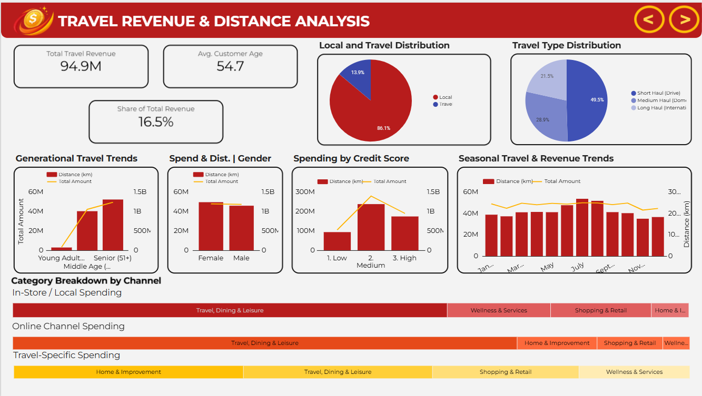
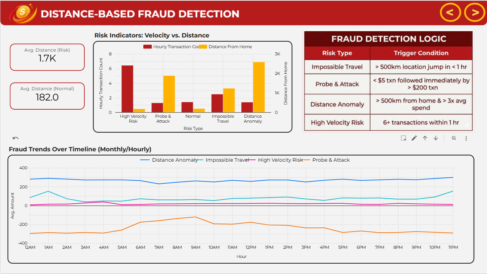
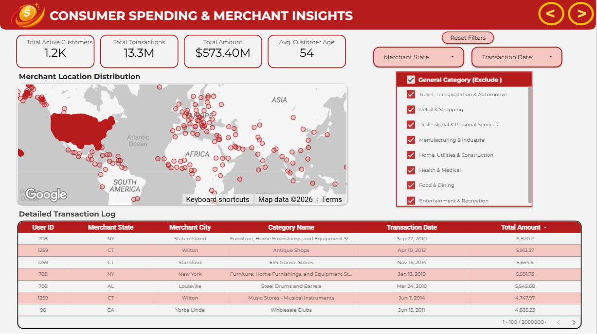

# Financial Fraud Detection & ETL Pipeline

## Project Overview
This project focuses on detecting fraudulent banking transactions using Machine Learning (XGBoost) and building a robust ELT pipeline with BigQuery and dbt.

We analyzed over 13 million transaction records to identify risk patterns, resulting in a model with 0.99 ROC-AUC performance. By integrating external public datasets, we successfully engineered location-based features to detect complex fraud scenarios like "Impossible Travel."

---

## Source Code & Collaboration
This project was developed as a collaborative group effort.
* **Full Source Code:** The complete codebase (including dbt models and Python scripts) is hosted in our team repository.
* **[Click here to view the Source Code](https://github.com/Dicleern/Finansal-Risk-Analizi-new-)**

*This repository serves as a portfolio showcase focusing on the analytical results, model performance metrics, and the final technical report.*

---

## My Individual Contribution
In this group project, I took ownership of the Machine Learning and Data Engineering modules:

* **Feature Engineering & Geolocation Analysis:** I enriched the raw transaction data by integrating external public geolocation datasets. Using coordinate data, I calculated the geodesic distance between "User Home" and "Merchant Location" for every transaction.
* **Distance-Based Metrics:** These calculations allowed us to derive critical features such as "Distance from Home" and categorize transactions (Local vs. Travel), which became top predictors for fraud detection.
* **ML Modeling (XGBoost):** Trained and optimized the XGBoost model, achieving 90% Recall and 0.99 ROC-AUC, minimizing false negatives.
* **ETL with dbt:** Managed data transformation workflows in BigQuery using dbt, ensuring clean and structured data for the model.

---

## Key Results & Visualizations

### 1. Model Performance (Confusion Matrix)
The XGBoost model successfully identified 797 fraudulent transactions with high precision, significantly reducing financial risk.

### 2. Travel & Distance Analysis (Feature Engineering)
By leveraging public location data, we analyzed spending behaviors based on distance. This visualization highlights how we segmented transactions into "Short Haul," "Medium Haul," and "Long Haul" to spot anomalies inconsistent with normal user travel patterns.

### 3. Fraud Trends & Anomaly Detection
We identified distinct patterns such as "Impossible Travel" (transactions occurring in distant locations within a short time frame) and high-velocity transaction spikes.

### 4. Geospatial Risk Analysis
Mapping transaction densities helped us visualize high-risk regions and correlate them with user spending habits.

---

## Repository Contents
* **[Financial_Fraud_Analysis_Report.pdf](Financial_Fraud_Analysis_Report.pdf)**: The detailed technical report covering the methodology, data pipeline architecture, and business insights.

---

## Tools & Technologies
* **Cloud & Database:** Google BigQuery
* **Data Engineering:** dbt (data build tool), SQL
* **Machine Learning:** Python, XGBoost, Scikit-learn, Pandas
* **Visualization:** Looker Studio

---

## Connect
* **Connect with me on LinkedIn:** [Elif Çal](https://www.linkedin.com/in/elifcal/)
